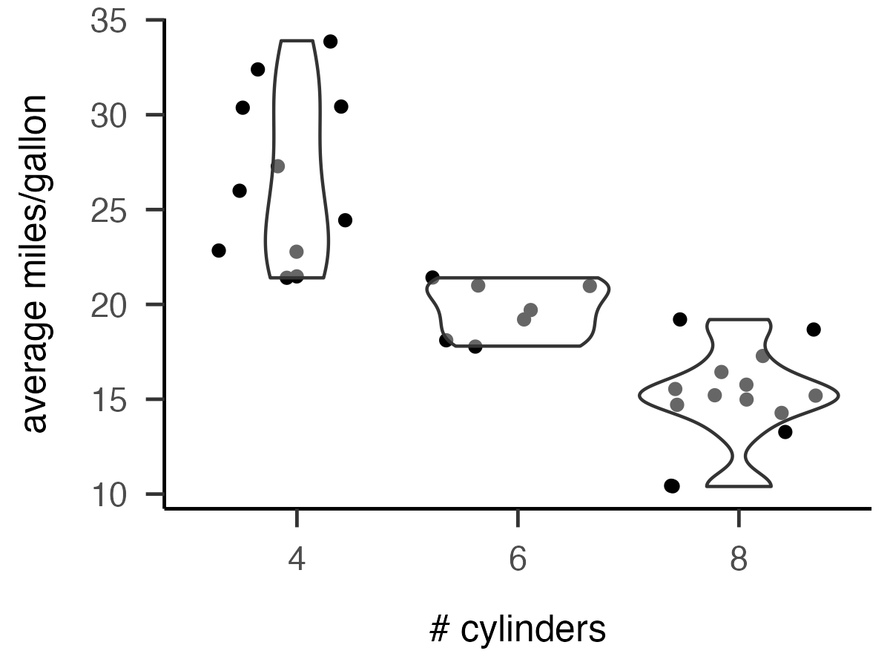
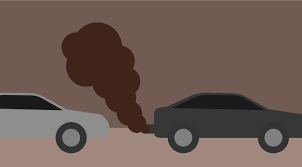
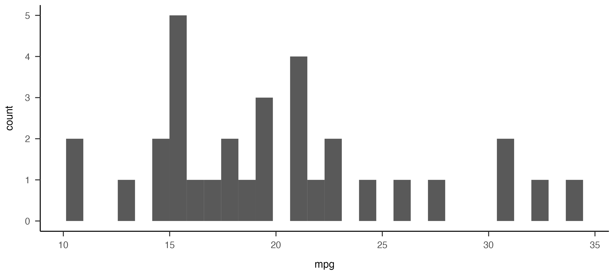

```{r setup, include = FALSE}
library(papaja)
library(tidyverse)
library(knitr)
r_refs("r-references.bib")
mydata <- as_tibble(mtcars, rownames = "model")
```

```{r analysis-preferences}
# Seed for random number generation
set.seed(42)
knitr::opts_chunk$set(cache.extra = knitr::rand_seed)
```

Lorem ipsum dolor sit amet, consectetur adipiscing elit. Ut efficitur commodo est quis mattis. Curabitur egestas enim sed est consectetur, eget porta quam viverra. Vivamus elit nisl, egestas vel rutrum fermentum, tempor at neque. Cras eros ipsum, pharetra quis sodales non, dignissim nec nisl. Mauris at ante ex. Vestibulum ante ipsum primis in faucibus orci luctus et ultrices posuere cubilia curae; Aliquam porta massa accumsan, euismod tellus at, condimentum orci. Duis pulvinar, lorem eu feugiat ullamcorper, nisl ante tincidunt tellus, ac egestas nulla felis molestie dolor. Nunc porttitor imperdiet enim, ut auctor lorem fringilla at. Vivamus sollicitudin, justo ac blandit interdum, tellus turpis porta mauris, quis convallis massa ipsum quis lorem. Integer convallis pretium nisl sit amet vehicula. Mauris posuere ipsum ex.[^1]

[^1]: This is a numbered footnote.

Integer accumsan ligula odio, ac ornare lacus congue sed. Suspendisse dictum elementum mi, eu condimentum nulla mollis nec. Sed velit ex, interdum ac magna ut, ultrices viverra lacus. Etiam a sapien ullamcorper, blandit leo at, iaculis ex. Praesent tincidunt ornare nisl, vitae efficitur ipsum elementum vitae. Orci varius natoque penatibus et magnis dis parturient montes, nascetur ridiculus mus. Integer libero diam, pellentesque ac rutrum vel, tincidunt at orci. Etiam ornare euismod sem eget mattis. Suspendisse et massa justo. Nullam mollis diam dui, nec auctor elit venenatis ut. Proin eu risus a quam facilisis cursus sed congue lacus. Sed vel lacus in purus malesuada consequat ut ac odio. [^named]

[^named]: This is a named footnote.

Phasellus ac aliquet quam. Fusce at interdum eros. Morbi vel dignissim erat. Sed et ex a est bibendum ornare ut vel ipsum. Nam dapibus, ante euismod bibendum consequat, urna nulla dapibus lectus, in dignissim odio sapien a libero. Donec quis orci luctus felis viverra mattis. Sed diam leo, accumsan ornare auctor sit amet, ultricies eget tellus. Ut dignissim, risus et ornare laoreet, metus dui aliquet odio, quis fermentum elit ante ac lorem. Etiam venenatis consequat quam, vel convallis nisl varius sit amet. Pellentesque libero nulla, gravida nec feugiat sit amet, aliquet sed ex. Suspendisse nulla nibh, mollis a erat quis, pharetra semper nulla. Morbi blandit imperdiet mauris ut pellentesque. Lorem ipsum dolor sit amet, consectetur adipiscing elit. Vestibulum et elit diam. Nulla gravida faucibus ligula, eget consectetur ex aliquet vel. Sed finibus vestibulum nibh, at blandit velit faucibus vitae.

Lorem ipsum dolor sit amet, consectetur adipiscing elit. Ut efficitur commodo est quis mattis. Curabitur egestas enim sed est consectetur, eget porta quam viverra. Vivamus elit nisl, egestas vel rutrum fermentum, tempor at neque. Cras eros ipsum, pharetra quis sodales non, dignissim nec nisl. Mauris at ante ex. Vestibulum ante ipsum primis in faucibus orci luctus et ultrices posuere cubilia curae; Aliquam porta massa accumsan, euismod tellus at, condimentum orci. Duis pulvinar, lorem eu feugiat ullamcorper, nisl ante tincidunt tellus, ac egestas nulla felis molestie dolor. Nunc porttitor imperdiet enim, ut auctor lorem fringilla at. Vivamus sollicitudin, justo ac blandit interdum, tellus turpis porta mauris, quis convallis massa ipsum quis lorem. Integer convallis pretium nisl sit amet vehicula. Mauris posuere ipsum ex.[^1]

## Tables

Knitting R documents can render tables in several different forms. To start, you have your basic "console style." This is more or less what you'd see in the console you just ran the table (or called the object) in an R script or directly in the console.

```{r table-avgmpg-consolestyle}
mydata %>%
  group_by(cyl) %>%
  summarize(
    mean.mpg = mean(mpg),
    sd.mpg = sd(mpg),
    n.models = n()
  )
```

The `knitr` package contains the `kable()` function. Passing a dataframe into this function will produce a formatted table that's already pretty nice looking without needing additional modification. When you run the code chunk in R Studio, it is clearly different from the console version, but it's not exactly beautiful. However, that output that appears beneath your code chunk isn't the same as what you'll see when you actually knit it.

You don't need to do anything more than pipe the df to `kable()` to get this formatted table, but we can add optional arguments like `caption`. 

```{r table-avgmpg-kablestyle}
mydata %>%
  group_by(cyl) %>%
  summarize(
    mean.mpg = mean(mpg),
    sd.mpg = sd(mpg),
    n.models = n()
  ) %>%
  knitr::kable(caption = "mpg stats by number of cylinders")
```

From there we can add in many additional arguments to tweak the visuals of this already decently formatted table exactly to our preferences. Alternatively, we can use "wrapper" functions that add in a collection of tweaks for us, like the `apa_table()` function in `papaja`, which will knit the table in APA formatting.

In this example, rather than piping the df into the function (which we could have done), the df is saved as an object that is then used as the `data` argument. Because `apa_table()` is a wrapper, we can still use the same arguments with the basic `kable()` function, like `caption`.

Some wrapper functions, including `apa_table()`, rely on LaTeX formatting that can't render in R Studio. When you run the chunk in your R notebook, you'll just see a blank box. The APA formatted table will render in your Word or PDF document. Note that not all wrapper functions will have this "blank box problem." Other wrappers will not only not show up in R Studio, but will only render in either Word *or* PDF format.

```{r table-avgmpg-apastyle, results = 'asis'}
mytable <- mydata %>%
  group_by(cyl) %>%
  summarize(
    mean.mpg = mean(mpg),
    sd.mpg = sd(mpg),
    n.models = n()
  )

#apa_table(mytable, caption = "mpg stats by number of cylinders")
```


Back to the basic kable, there is nearly unlimited customization you can employ, especially if you use the [`kableExtra`](https://haozhu233.github.io/kableExtra/) package (which is exactly what it sounds like). Here are a handful of modifications I think you're most likely to want to know about:

  1. Add a caption
  2. Change column names
  3. Specify column alignment
  4. Format columns
  5. Style table size and position
  6. Make row- and column-specific tweaks
  7. Group rows, columns, and cells
  8. Add table (foot)notes

Many of the examples below are taken or adapted from the [R Markdown Cookbook](https://bookdown.org/yihui/rmarkdown-cookbook/tables.html).

These tables modify column names and alignment identically but with slightly different syntax and add captions to describe each:

```{r table-column-names-alignment1}

kable(iris, 
      col.names = c("Sepal Length",	"Sepal Width",	"Petal Length",	"Petal Width",	"Species"), 
      align = c("l", "r", "l", "r", "c"),
      caption = "Change each column name and text alignments, each with a list of strings.")

```

```{r table-column-names-alignment2}

kable(iris, 
      col.names = gsub("[.]", " ", names(iris)), 
      align = "lrlrc",
      caption = "Use 'gsub' function to replace periods with spaces and change text alignments with a single 'shortcut' string.")


```

These tables specify format of numeric columns:

```{r table-column-formats1}

d <- cbind(
  X1 = runif(3), 
  X2 = 10^c(3, 5, 7), 
  X3 = rnorm(3, 0, 1000))

kable(d, digits = 4,
      caption = "All numeric data in all columns display at most 4 decimal places")

```

```{r table-column-formats2}

kable(d, digits = c(5, 0, 2),
      caption = "Round columns to 5, 0, and 2 digits (respectively).")

```

```{r table-column-formats3}


kable(d, digits = 3, 
      format.args = list(big.mark = ",", # Use US notation of including a comma (vs period) every three digits
                         scientific = FALSE),
      caption = "Round all data to max 3 decimal places and do not use scientific notaiton.")

```

For the second half of the list (5-8), we need the `kableExtra` package. Most things that this package can do will work in both Word and PDF outputs, but Word does not support LaTeX formatting. As a result, the results are pretty iffy. Sticking with PDF output format is recommended. If you need to knit to a Word doc, refer to the package documentation for suggestions on how to do so.

This package includes the `kbl()` function, which is *identical* to `kable()`. If you have `kableExtra` loaded you can use either, but the advantage of using `kbl()` is that it will throw an obvious error if you don't have the package loaded, which you might not notice otherwise.

To use styling functions in the `kableExtra` package, you'll create a kable with `kable()` or `kbl()` and pipe (`%>%`) it into the style function. Examples in this section come from the `kableExtra` package [documentation](https://haozhu233.github.io/kableExtra/).

```{r load-kableExtra}

library(kableExtra)
dt <- mtcars[1:5, 1:6]

```

By default, knitr will place tables wherever it thinks the best place in your document for that table will be. This is often great, but sometimes it's a very bad guesser. It will also guess the size/scale your table should be. You can control these things yourself.

In Table\ \@ref(tab:table-hold-position), the `hold_position` style option "pins" the table where you call it. Most examples from here on will include this argument.


```{r table-hold-position, results='asis'}

kbl(dt, 
    caption = "Table will appear exactly where you call it."
    ) %>%
  kable_styling(latex_options = "hold_position")

```

Table\ \@ref(tab:table-size-scaledown), shows the use of the `scale_down` option (with `hold_position`) to scale a wide table down to fit on the page. This can be used instead of or in addition to printing the table in landscape page format. See the `kableExtra` docs for how to do that.

```{r table-size-scaledown, results='asis'}

kbl(cbind(dt, dt, dt), # create a very wide table
    caption = "When you have a wide table that will normally go out of the page, and you want to scale down the table to fit the page, you can use the scale down option.") %>%
  kable_styling(latex_options = c("scale_down", "hold_position"))

```

You can also scale *up* a table to make a small/narrow table full width with either the `scale_up` option (Table\ \@ref(tab:table-size-scaleup)) or `full_width` argument (Table\ \@ref(tab:table-size-fullwidth)).

```{r table-size-scaleup, results='asis'}

kbl(cbind(dt),
    caption = "Use the scale up option to stretch to full page width.") %>%
  kable_styling(latex_options = c("scale_up", "hold_position"))
```

```{r table-size-fullwidth, results='asis'}

kbl(dt, 
    caption = "Stretch a small table to fit the page with the full width option.") %>%
  kable_styling(full_width = T, latex_options = c("hold_position"))

```


When you have very long tables that would extend over multiple pages, use the `longtable` argument, usually in combination with the `repeat_header` option (Table\ \@ref(tab:table-size-longtable)).

```{r table-size-longtable, results='asis'}

long_dt <- rbind(mtcars, mtcars) # create a very long table
kbl(long_dt, 
    longtable = T, 
    caption = "Use the 'longtable' argument in the kbl() to intelligently manage very long tables. Use the repeat header LaTeX option ") %>%
 # add_header_above(c(" ", "Group 1" = 5, "Group 2" = 6)) %>%
  kable_styling(latex_options = c("repeat_header", "hold_position"))
```

By default, tables are aligned center on the page, but they can also be aligned left or right. Note that alignment does not apply to full width tables. Table\ \@ref(tab:table-alignleft) uses the `position = "left" argument` to align left. Oddly, aligning right in the same way doesn't work as expected. In theory you can "float right" rather than position right, but this can produce errors. It's unlikely you'll need to right align a table though.

```{r table-alignleft, results='asis'}

kbl(dt, 
    caption = "Align your table (not the text, the whole table), 'left' or 'center' (the default) with the position argument.") %>% 
  kable_styling(position = "left", latex_options = c("hold_position"))
```


```{r table-floatright, eval=FALSE, include=FALSE, results='asis'}
## BREAKS!
kbl(dt, 
    caption = "Use float right to right align your table if needed.") %>% 
  kable_styling(position = "float_right")
```

You can make style adjustments to the whole table (e.g., font fact, background color, bold/italic) or to specific rows and columns. Table\ \@ref(tab:table-col-specs) includes three `column_spec` functions to modify properties in columns 2, 6, and 9.

```{r table-col-specs, eval=FALSE, include=FALSE, results='asis'}
mtcars[1:8, 1:8] %>%
kbl(booktabs = T,
    caption = "This table uses column specifications to make many visual modifications to individual rows. The final line shows how the same function can modify just one cell in a column in a similar way.") %>%
  kable_paper(full_width = F) %>%
  column_spec(2, color = spec_color(mtcars$mpg[1:8]),
             link = "https://haozhu233.github.io/kableExtra") %>%
  column_spec(6, color = "white",
             background = spec_color(mtcars$drat[1:8], end = 0.7),
             popover = paste("am:", mtcars$am[1:8])) %>%
#  The c(rep(XX,7), XX) bit here is basically saying
#  in this column (9) treat the first 7 columns one way and then the rest (the last)
#  this other way. e.g., strikeout should be FALSE for the 1st seven rows but TRUE
#  for the rest, color should be BLACK for 1-7 but RED for the rest
  column_spec(9, strikeout = c(rep(F, 7), T), bold = c(rep(F, 7), T),
             color = c(rep("black", 7), "red"))

```

Table\ \@ref(tab:table-row-specs) includes two `row_spec` functions to modify properties in rows 1 and rows 3-5.

```{r table-row-specs, eval=FALSE, include=FALSE, results='asis'}

kbl(dt, booktabs = T,
    caption = "You can specify styling for rows in the same way.") %>%
  kable_styling(full_width = F) %>%
  column_spec(7, border_left = T, bold = T) %>%
  row_spec(1, strikeout = T) %>%
  row_spec(3:5, bold = T, color = "white", background = "black")

```

You can "group" rows and columns, basically equivalent to merging cells in a spreadsheet. This is commonly needed for multi-level headers or organizing non-rectangular data (like a lot of model output). Table\ \@ref(tab:table-grouping-addheader) uses the `add_header_above()` function to do so.

```{r table-grouping-addheader, eval=FALSE, include=FALSE, results='asis'}

kbl(dt, 
    caption = "Create grouped columns by adding a header.") %>%
  kable_styling(latex_options = c("hold_position")) %>% 
  # The syntax within the list is "name of group header = [number of columns to be grouped under it]. Make sure the total number of columns to group equal the actual number of columns in the table
  add_header_above(c(" " = 1, "Group 1" = 2, "Group 2" = 2, "Group 3" = 2))

```

You can group more than once and format these header rows individually. Use the total number of rows to specify how many columns to group, not the number of rows in the grouped row below it (Table\ \@ref(tab:table-grouping-multiple)).

```{r table-grouping-multiple, results='asis'}

kbl(dt, 
    caption = "Group multiple times and format these header rows individually.") %>%
  kable_styling(latex_options = c("hold_position")) %>% 
  # If you don't specify how many columns to group for that group name, it assumes =1
  add_header_above(c(" ", "Group 1" = 2, "Group 2" = 2, "Group 3" = 2)) %>%
  add_header_above(c(" ", "Group 4" = 4, "Group 5" = 2)) %>%
  add_header_above(c(" ", "Group 6" = 6), bold = T, italic = T)

```

Grouping rows is a little different. Table\ \@ref(tab:table-grouping-packrows) uses the `pack_rows()` function to effectively add "header rows" throughout the table.

```{r table-grouping-packrows, results='asis'}

kbl(mtcars[1:10, 1:6], 
    caption = "Group rows using packing.") %>%
  kable_styling(latex_options = c("hold_position")) %>% 
  # syntax here is ("group label", [int of first row to include in group][int of last row to include])
  pack_rows("Group 1", 4, 7) %>%
  pack_rows("Group 2", 8, 10)

collapse_rows_dt <- data.frame(C1 = c(rep("a", 10), rep("b", 5)),
                               C2 = c(rep("c", 7), rep("d", 3), rep("c", 2), rep("d", 3)),
                               C3 = 1:15,
                               C4 = sample(c(0,1), 15, replace = TRUE))

```

Alternatively, use `collapse_rows()` (Table\ \@ref(tab:table-grouping-collapse)) for more of a "merge cells" effect. 

```{r table-grouping-collapse, results='asis'}


collapse_rows_dt <- data.frame(C1 = c(rep("a", 10), rep("b", 5)),
                               C2 = c(rep("c", 7), rep("d", 3), rep("c", 2), rep("d", 3)),
                               C3 = 1:15,
                               C4 = sample(c(0,1), 15, replace = TRUE))

# You will only see the "collapse" happen when you knit
# not when you run the chunk
kbl(collapse_rows_dt, booktabs = T, align = "c",
    caption = "Collapse rows for more of a 'merge cells' effect.") %>%
  column_spec(1, bold=T) %>%
  collapse_rows(columns = 1:2,
                latex_hline = "major",
                row_group_label_position = "first")
```


Finally, you can add notes or footnotes below your table with the `footnote()` function. Table\ \@ref(tab:table-footnotes) includes the 'general' argument for an unlabeled note and 'number', 'alphabet', and 'symbol' for footnotes with ordered labels.

```{r table-footnotes, results='asis'}
kbl(dt, align = "c",
    caption = "Add unordered (general) and ordered footnotes.") %>%
  kable_styling(full_width = F) %>%
  footnote(general = "Here is a general comments of the table. ",
           number = c("Footnote 1; ", "Footnote 2; "),
           alphabet = c("Footnote A; ", "Footnote B; "),
           symbol = c("Footnote Symbol 1; ", "Footnote Symbol 2")
)
```

There is **so much more** you can do with kables! I am personally a huge fan of kables and the kableExtra package because it works beautifully with papaja, but you can also explore other packages for making beautiful tables:

  - [flextable](https://davidgohel.github.io/flextable/)
  - [gt table](https://gt.rstudio.com/)
  - [xtable](http://xtable.r-forge.r-project.org/)
  - [stargazer](https://cran.r-project.org/web/packages/stargazer/index.html)
    - This one is designed to simplify tables for regression output
  


## Figures and images

Phasellus finibus ac est vitae consectetur. Donec a condimentum nisi, ut accumsan leo. Praesent ut viverra est. Praesent sit amet posuere arcu, ac cursus sem. Cras volutpat ut urna et tincidunt. Ut leo ante, varius ut congue eget, maximus a eros. Fusce mollis luctus ligula et tristique. Nulla facilisi.

```{r fig-avgmpg, fig.cap = "distribution of mpg by number of cylinders (2, 4, or 6)"}
ggplot(mydata, aes(x = factor(cyl), y = mpg)) +
  geom_jitter() +
  geom_violin(alpha = 0.4) +
  labs(x = "# cylinders", y = "average miles/gallon")
```


<!--
Markdown and LaTeX syntax is not well supported in chunk options, such as fig.cap, or elsewhere inside a code chunk, e.g., in the caption argument of apa_table(). Specifically, Markdown formatting and citation syntax are ignored (rendered as-is) and, for example, \ and _ must be escaped to prevent errors in either R or LaTeX. None of these limitations apply to text references.
-->

(ref:fig-avgmpg-caption) distribution of mpg by number of cylinders (2, 4, or 6)

```{r fig-avgmpg-thmapa, fig.cap = "(ref:fig-avgmpg-caption)"}
ggplot(mydata, aes(x = factor(cyl), y = mpg)) +
  geom_jitter() +
  geom_violin(alpha = 0.4) +
  labs(x = "# cylinders", y = "average miles/gallon") +
  theme_apa()

```


(ref:fig-cyl-mpg-caption) now we can import the saved figure too

```{r fig-cyl-mpg, fig.cap = "(ref:fig-cyl-mpg-caption)"}
(ggplot(mydata, aes(x = factor(cyl), y = mpg)) +
  geom_jitter() +
  geom_violin(alpha = 0.4) +
  labs(x = "# cylinders", y = "average miles/gallon") +
  theme_apa()) %>%
  ggsave("numcyls.vs.mpg.png", ., width = 4, height = 3)


```

(ref:fig-smog-caption) yowza

```{r fig-smog, fig.cap = "(ref:fig-smog-caption)"}

```


```{r fig-BIGsmog, fig.cap = "(ref:fig-smog-caption)", out.width = "300%", fig.align = "center"}

```

(ref:fig-mpghist-caption) histogram of mpg values across all car models.

```{r fig-mpghist, fig.cap = "(ref:fig-mpghist-caption)", out.width = "75%", fig.align = "center"}
(ggplot(mydata, aes(x = mpg)) +
  geom_histogram() +
  theme_apa()) %>%
  ggsave(filename = "figures/mpg-histogram.png", device = "png", width = 10, units = "in")

```

Maecenas in fermentum enim. Sed elit diam, mollis rutrum turpis nec, pretium pellentesque massa. Aliquam nulla enim, venenatis eu mattis id, posuere sit amet lectus. Nullam auctor sit amet metus ut pharetra. Curabitur lorem libero, dignissim vitae dui ac, tristique hendrerit velit. Sed ac ultricies mi. Pellentesque sem tellus, blandit eget lacinia at, vehicula id sapien.

Curabitur finibus euismod nulla vel ornare. Morbi semper eros a placerat ullamcorper. Fusce rutrum ipsum vestibulum urna sodales, iaculis elementum massa rhoncus. Vestibulum at erat ut enim hendrerit tristique vitae non ex. Duis dapibus, ex at suscipit consequat, diam ipsum molestie nunc, id posuere dui est vitae odio. Orci varius natoque penatibus et magnis dis parturient montes, nascetur ridiculus mus. Nunc sed dictum arcu. Duis mattis vel urna ac ullamcorper. Vivamus eu elit nec mi iaculis rutrum eget quis metus. Aliquam molestie vehicula placerat. Etiam bibendum quis mi et malesuada. Mauris et imperdiet ligula, volutpat cursus orci. Aenean non dolor cursus, pretium nisl ac, porttitor neque. Donec consequat lorem leo, elementum sagittis eros molestie quis.

Donec sollicitudin sollicitudin ullamcorper. Quisque ac ultrices massa. In orci urna, sollicitudin sit amet eleifend eu, tincidunt quis urna. Nulla auctor iaculis nunc non accumsan. Sed a laoreet massa. Sed sit amet hendrerit nulla, in tempor urna. Maecenas tempor congue ante ac elementum. Etiam erat magna, suscipit in volutpat nec, vestibulum placerat neque. Sed sed mi leo. Vivamus bibendum dui quis ligula tempor, eu ultrices velit sodales. Aenean eu tincidunt odio. Vivamus ante massa, aliquet vitae sagittis non, pellentesque quis quam.

Suspendisse nunc sem, pellentesque non euismod sed, porttitor sit amet ante. Praesent feugiat erat a commodo lacinia. Morbi eleifend egestas ligula, nec blandit mi consectetur nec. Vivamus vestibulum diam eget mi venenatis facilisis. Mauris nec ligula et nisi iaculis ultricies ac a enim. Nullam congue risus in ex dapibus ullamcorper. Quisque pretium ex eget rhoncus convallis. Sed ante eros, semper euismod dignissim ut, consectetur rhoncus justo. Fusce lacinia metus ut sapien tincidunt posuere. Suspendisse malesuada, tellus ac tincidunt ornare, diam sapien porttitor leo, sed mollis dolor ante vitae orci. Aliquam nisi nisi, posuere eu lobortis sit amet, egestas eget massa.

Quisque posuere massa et augue finibus aliquam. Morbi iaculis accumsan metus, eget lobortis ligula facilisis vitae. Integer arcu turpis, consectetur luctus mollis eu, iaculis convallis arcu. Aenean at eros bibendum, tempus sapien ac, cursus eros. Suspendisse pretium neque sit amet erat maximus, vitae malesuada orci auctor. Nam nulla ligula, eleifend quis nibh ut, ornare mattis eros. Maecenas auctor diam at efficitur accumsan. In imperdiet elit vitae orci feugiat tristique eget ut dui. Morbi ut ipsum magna. Maecenas rhoncus non velit sit amet bibendum. Nullam sit amet risus sit amet velit mattis sagittis. Nunc id nisl tincidunt, laoreet felis quis, sagittis massa. Phasellus eu justo nec tortor molestie bibendum quis eu enim. Duis quis sagittis purus, vitae aliquet metus. Proin ex eros, pharetra ultrices quam quis, volutpat congue erat. Cras luctus sapien ipsum, vel suscipit libero dignissim a.

Proin elementum tempus sollicitudin. Nam bibendum consequat metus vitae gravida. Mauris consequat velit nibh, blandit blandit nunc viverra sit amet. Donec tincidunt elit sed lacus malesuada viverra. Nulla vel neque nisi. Cras mollis tortor id magna varius condimentum. Donec eu mauris pharetra risus sodales viverra. Nunc quis velit eleifend, porta arcu nec, tincidunt sapien. Donec at dolor massa. Nam blandit sollicitudin velit sit amet convallis. Vivamus at pretium tortor, ut pulvinar mi. Aenean vitae varius nulla. Sed sapien magna, porttitor quis urna sit amet, luctus iaculis tellus. Mauris vel sollicitudin quam, sed congue turpis. Pellentesque vitae ipsum a neque feugiat laoreet.

## Chunk references

The average miles per gallon across cars with different numbers of cylinders is shown in Figure\ \@ref(fig:fig-avgmpg-thmapa), as also summarized in Table\ \@ref(tab:table-avgmpg-apastyle). Carbon production (e.g., see Figure\ \@ref(fig:fig-BIGsmog) is an an extremely unfortunate side effect of human industry that has immense consequences for the sustainability on life on Earth. Cars vary in their gasoline efficiency (Figure\ \@ref(fig:fig-mpghist)).


Morbi ut nulla non justo imperdiet pellentesque a placerat odio. Nulla mattis diam dolor, ac lacinia ipsum aliquet non. Morbi ac malesuada quam. Ut vel venenatis quam. Morbi dapibus mi quis leo imperdiet, at tempor nunc porttitor. Cras et tortor posuere, pretium dolor vel, sodales justo. Duis condimentum varius eros, id accumsan felis laoreet ut. Etiam ex nunc, ullamcorper eget condimentum sit amet, commodo eu erat. Donec id lacinia erat. Quisque ultricies sit amet justo vitae malesuada.

Nullam at lectus nisl. Donec id nisl odio. Sed egestas orci nec eleifend rhoncus. Sed suscipit vel tellus blandit consectetur. Quisque eu nibh arcu. Proin non libero facilisis, accumsan velit vel, porttitor ex. Aliquam venenatis, diam et auctor aliquet, nisl tortor ullamcorper sem, sed elementum libero sem volutpat arcu. Maecenas pharetra justo eros, ac sodales sem maximus sed. Donec cursus varius libero a condimentum. In eleifend sollicitudin tellus, in gravida risus vulputate ut. Aliquam erat volutpat. Pellentesque finibus erat nec efficitur elementum.

Cras venenatis, augue non tempor interdum, libero tellus vestibulum metus, ac sollicitudin risus neque non nibh. Nunc ac magna nisl. Orci varius natoque penatibus et magnis dis parturient montes, nascetur ridiculus mus. Aenean mauris tellus, vulputate a dictum eu, ullamcorper in dui. Suspendisse tempor, justo eu dictum convallis, elit velit tempor mi, id feugiat est erat sit amet lectus. Aenean vel libero eu enim lacinia condimentum ac ac augue. Morbi in justo eu nisl porta porta. Nullam vitae ligula ac ipsum mollis lacinia. Sed vulputate eros vel odio viverra porttitor. Vestibulum fermentum placerat velit, a egestas turpis ultricies quis. Vivamus at purus semper, luctus diam ut, venenatis justo. Aliquam dignissim risus at ipsum pellentesque, in auctor felis vehicula. Duis quis fringilla enim.

Sed aliquam turpis interdum erat elementum, ac semper ipsum tempor. Vivamus nisi massa, pulvinar quis dapibus in, egestas faucibus lectus. Nam eleifend massa urna. Integer placerat, lacus id molestie maximus, tortor ante imperdiet ligula, id scelerisque arcu diam et erat. Aenean hendrerit nibh ullamcorper, consequat eros ultrices, fringilla libero. Morbi a metus non lacus imperdiet euismod. Duis a lectus nec purus maximus consectetur. Curabitur feugiat risus orci, ut consequat nulla facilisis at. Cras varius tincidunt placerat. Duis gravida odio sit amet sapien ultrices, vitae vulputate elit imperdiet. Pellentesque justo nulla, tincidunt id mauris sit amet, volutpat ornare sapien.

Quisque at elementum nisi, ut euismod dolor. Lorem ipsum dolor sit amet, consectetur adipiscing elit. Maecenas ultrices tempus sem, a finibus dui dignissim vel. Aliquam commodo maximus lectus id cursus. Class aptent taciti sociosqu ad litora torquent per conubia nostra, per inceptos himenaeos. Morbi vitae elit mi. Aliquam ultricies risus magna, id vestibulum justo pretium vitae. Class aptent taciti sociosqu ad litora torquent per conubia nostra, per inceptos himenaeos. Cras ornare ligula ligula, at vehicula magna laoreet vel. Donec semper quam vitae eros consequat, id auctor tellus aliquet. Aliquam eget vestibulum eros. Integer hendrerit in turpis eu elementum. Nunc eget elementum massa.

Nullam ultricies tortor auctor ultricies convallis. Phasellus eu ligula tincidunt, facilisis arcu ac, tincidunt mi. Maecenas gravida facilisis nisl nec pulvinar. Integer dui dui, dictum vel velit et, posuere tempus orci. Cras erat ex, venenatis eu nisi eu, congue aliquet dui. Pellentesque dignissim auctor mauris in suscipit. Vivamus convallis fringilla ante ac molestie. Ut pretium fringilla molestie. Nullam maximus elit id justo convallis cursus. Phasellus sagittis quam aliquam fermentum mollis. Orci varius natoque penatibus et magnis dis parturient montes, nascetur ridiculus mus. Phasellus vitae ultricies est. Quisque eleifend mauris enim. Sed sed egestas est. Donec pretium risus orci, non placerat elit tempus at.

Maecenas viverra nulla sed justo tincidunt porta. In non suscipit lacus. Duis sapien nulla, cursus nec turpis sed, faucibus imperdiet tortor. Sed euismod dictum diam nec pellentesque. Ut finibus eget mauris ac vulputate. Duis luctus cursus finibus. Vivamus ac purus tincidunt, interdum leo nec, ultrices ante. Suspendisse velit sem, tincidunt sit amet porta eu, commodo a ligula. Etiam quis ligula non purus sollicitudin faucibus at et massa. Praesent fringilla turpis et turpis convallis blandit. Curabitur et risus non sapien blandit commodo. Nulla sodales gravida erat, sed fringilla metus imperdiet ac. Sed interdum gravida leo vitae luctus.

Orci varius natoque penatibus et magnis dis parturient montes, nascetur ridiculus mus. Nam quam libero, porttitor ac elit sit amet, condimentum sagittis diam. Morbi luctus, diam posuere tempor imperdiet, nisl magna commodo orci, nec sagittis risus lacus eget purus. Sed vel neque feugiat, luctus turpis vitae, volutpat arcu. Nulla facilisi. Curabitur quis nunc fermentum tellus maximus bibendum. Quisque porttitor id arcu eu imperdiet.


\newpage

# References

\begingroup
\setlength{\parindent}{-0.5in}
\setlength{\leftskip}{0.5in}

<div id="refs" custom-style="Bibliography"></div>
\endgroup
