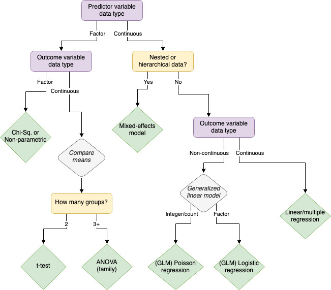

```{r setup, include = FALSE}

# Load necessary libraries

library(tidyverse)
library(psych)
library(stats)
library(lme4)
library(scales)
library(broom)
library(papaja)


#r_refs("r-references.bib")
```

```{r analysis-preferences}
# Seed for random number generation
set.seed(42)
knitr::opts_chunk$set(
  cache.extra = knitr::rand_seed,
  fig.height = 6,
	fig.width = 7,
	message = TRUE,
	warning = FALSE,
	comment = ""
  )
```


# Descriptive statistics

```{r load-sw-df}
# Use built-in dataset 'starwars' for analysis
sw.desc <- starwars %>% 
  select(height, mass) %>% 
  drop_na() # as an alternative, include the `na.rm=T` argument in your measures functions

# Create a long version to use for dplyr and ggplot stuff later
sw.desc.long <- sw.desc %>% 
  pivot_longer(c(height, mass), names_to = "measure") 
```


The quickest way to see summary statistics for a numeric variable is the `summary()` function:

```{r summary-function}
summary(sw.desc$height)
summary(sw.desc$mass)
```

Or if you need to keep things a little more organized, create a summarized dataframe:

```{r summarize-df}
sw.desc.long %>% 
  group_by(measure) %>% 
  summarize(mean = mean(value),
         median = median(value),
         sd = sd(value),
         min = min(value),
         max = max(value),
         range = max-min,
         range = diff(range(value))
  ) #%>% kable()
```

## Distributions

### Calculate measures of center

You can also calculate everything piece by piece.

"Measures of center" are different ways of talking about averages. Usually we think about "mean" as synonymous with "average", so calling these measures of center instead can be more precise. 

Calculate mean and median with `mean()` and `median()`. There is no built-in mode function, but if you need one you can either write your own function or use the `modeest` library.

```{r measures-of-center}
mean_height <- mean(sw.desc$height)
median_height <- median(sw.desc$height)

mean_mass <- mean(sw.desc$mass)
median_mass <- median(sw.desc$mass)
```

  - The mean height is `r round(mean_height, 3)` cm and median height is `r median_height` cm.
  - The mean mass is `r round(mean_mass, 3)` kg and median mass is `r median_mass` kg.


### Calculate measures of spread

Measures of spread describe the distribution of continuous data around the center. Calculate standard deviation with `sd()`. Calculate range by getting a list of the minimum and maximum with `range()` and then using `diff()` to find the difference between the two.

```{r measures-of-spread}
sd_height <- sd(sw.desc$height) # standard deviation
range_height <- diff(range(sw.desc$height))

sd_mass <- sd(sw.desc$mass) # standard deviation
range_mass <- diff(range(sw.desc$mass))
```

  - The standard deviation of height is `r round(sd_height, 3)` cm and the range is `r round(range_height, 3)` cm.
  - The standard deviation of mass is `r round(sd_mass, 3)` kg and the range is `r round(range_mass, 3)` kg.
  
Other common measures of spread include variance, quantiles, and interquartile range (Table\ \@ref(tab:more-spread-measures):


```{r more-spread-measures, results='asis'}

sw.desc.long %>% 
  group_by(measure) %>% 
  summarize(variance = var(value),
            median1 = median(value),
            median2 = quantile(value, probs=0.5),
            quartile = quantile(value, probs = c(.25, .75)),
            iqr1 = IQR(value)
  ) %>%  ## Comment out this pipe and the apa_table() to see the table rendered when you run the code chunk. Leave this in to see it render in APA format when you knit the document.
  apa_table()

```


### Visualize center and spread

Distribution plots visualize center and spread, for example histograms (Figure\ \@ref(fig:histogram)), density plots (Figure\ \@ref(fig:density)), boxplots (Figure\ \@ref(fig:boxplot)), and violin plots (Figure\ \@ref(fig:violin)).

(ref:histogram-caption) Histogram of height and mass distributions

```{r histogram, fig.cap="(ref:histogram-caption)"}
ggplot(sw.desc.long) +
  geom_histogram(aes(value), binwidth=15) + facet_wrap(vars(measure), ncol=1)

```

(ref:density-caption) Density of height and mass distributions

```{r density, fig.cap="(ref:density-caption)"}

ggplot(sw.desc.long) +
  geom_density(aes(value, color=measure))
```


(ref:boxplot-caption) Boxplot of height and mass distributions

```{r boxplot, fig.cap="(ref:boxplot-caption)"}

ggplot(sw.desc.long) +
  geom_boxplot(aes(value, fill=measure)) +
  scale_x_continuous(limits=c(0,300), oob=squish) 
# you need the `scales` package for the oob argument to work as expected
# in this case the scale will "squish" values outside the limits
# to the nearest limit, so Jabba's huge mass will look like 300
```


(ref:violin-caption) Violin plot of height and mass distributions

```{r violin, fig.cap="(ref:violin-caption)"}

ggplot(sw.desc.long) +
  geom_violin(aes(x=measure, y=value, fill=measure)) +
  scale_y_continuous(limits=c(0,300), oob=squish) 
# you need the `scales` package for the oob argument to work as expected
# in this case the scale will "squish" values outside the limits
# to the nearest limit, so Jabba's huge mass will look like 300
```

## Correlation

The `cor()` function creates a correlation matrix:

```{r cormatrix}

mass_height_corr <- cor(sw.desc) # using a matrix-like object (e.g., df)
mass_height_corr2 <- cor(sw.desc[,1], sw.desc[,2]) # or vectors (e.g., df columns)

mass_height_corr
mass_height_corr2

```

The correlation of height and mass is `r round(mass_height_corr2, 3)`.

If you intend to use a correlation as a (quasi)hypothesis test, you'll need the `corr.test()` function in the `psych` package to give you $p$-values,

```{r corr-tests}
mass_height_corr3 <- corr.test(sw.desc)
mass_height_corr4 <- corr.test(sw.desc[,1], sw.desc[,2])

mass_height_corr3
mass_height_corr4 
```
`View()` the object to see what the output contains and then extract elements like p-value:

```{r pull-corr-vals}
mass_height_corr3$p
mass_height_corr3$p.adj
mass_height_corr4$p
```

The default corr method is pearson, but you can change this. For example, Spearman rank correlation is useful for small samples:

```{r corr-spearman}
mass_height_corr_Spearman <- corr.test(sw.desc, method = "spearman")

```

<!-- When you reference object elements in R Markdown (e.g., the r- or p-values), you may need to use double square brackets. Try pasting the code below into the console with double brackets (like it's written) then again with just single brackets (i.e., ...#ci2["r"]). If the function returns anything other than a simple value, the double bracket tells R to just pull out the part of the object that is actually a value. --> 

  - Pearson $\rho$ = `r round(mass_height_corr3$ci2[["r"]], 3)` ($p$ = `r round(mass_height_corr3$ci2[["p"]], 3)`)
  - Spearman ranked $\rho$ = `r round(mass_height_corr_Spearman$ci2[["r"]], 3)` ($p$ = `r round(mass_height_corr_Spearman$ci2[["p"]], 3)`)


### Visualize correlation

Visualizing correlation is functionally the same as visualizing linear regression (though to truly visualize correlation you'd need to normalize the axes). Figure\ \@ref(fig:viz-corr) combines a scatter plot with a regression line (using `geom_smooth()`):

(ref:viz-corr-caption) Plot of correlation/regression between height and mass.

```{r viz-corr, fig.cap="(ref:viz-corr-caption)"}
ggplot(sw.desc) +
  geom_point(aes(height,mass)) +
  geom_smooth(aes(height,mass), method="lm") + 
  coord_cartesian(ylim = c(0,300))
```

You can also visualize the correlation matrix with functions from other packages, including `corPlot()` from the `psych` package (Figure\ \@ref(fig:psych-corPlot)), `corrplot()` from the `corrplot` package (Figure\ \@ref(fig:corrplot)), and `ggcorrplot()` from the `ggcorrplot` package (Figure\ \@(fig:ggcorrplot)).

```{r psych-corPlot}
psych::corPlot(sw.desc) 
```

```{r corrplot}
# Prefacing the function with the package name will run that function without loading
# the whole package, but the package does need to be installed on your machine
corrplot::corrplot(mass_height_corr)
```

```{r ggcorrplot}
ggcorrplot::ggcorrplot(mass_height_corr)
```

None of these are thrilling with just two variables, but they can be very useful when you're using a correlation matrix across many variables. Figure

(ref:more-interesting-matrices-caption) Correlation matrices for complex data, like the Harman (A) and Gorsuch (B) datasets in the psych package.

```{r more-interesting-matrices, fig.cap="(ref:more-interesting-matrices-caption)"}
library(patchwork) # The patchwork package allows you to combine multiple ggplot-like figures into a single figure
ggcorrplot::ggcorrplot(Harman23.cor$cov, title="Harman data") + ggcorrplot::ggcorrplot(Gorsuch, title="Gorsuch data") +
  plot_annotation(tag_levels = "A")
```


# Hypothesis Testing

Hypothesis testing is anything you might usually think of as "results." Essentially: *do these data suggest some kind of non-random pattern?* The best hypothesis test to use will depend on a few factors, most significantly the data type of the independent (predictor) and dependent (outcome) variables.

This flowchart is a quick-and-dirty, imperfect cheatsheet:

 <!-- By including this image directly in the R Markdown (rather than in a code chunk), it will not be treated as a "Figure". It won't have a label, won't be numbered, won't be listed in a figure list, can't be referenced, etc. -->

## Categorical Predictors

### t-tests

#### 1-sample

A 1-sample t-test tells you the likelihood that the "true" mean of a value is not equal to 0 (or another reasonable, specific alternative).

For example, a 1-sample t-test on the `mass` variable should return significant results, rejecting the null hypothesis that the true mean is 0. Since mass is necessarily a positive value, it is impossible that the true mean would be 0. 

```{r ttest-simple}
t.test(sw.desc$mass)
```

We can alternatively specify the mean that the null hypothesis should assume. Let's assume that the `starwars` dataset contains the mass of literally every character in Star Wars. In that case, the true population mean mass for Star Wars characters is `r round(mean(sw.desc$mass), 3)` kg. We can specify the null/true mean with the `mu` ($/mu$) argument.

Is the mean of this sample different than the true mean? 

```{r ttest-mu}
t.test(sw.desc$mass, mu=mean(sw.desc$mass))
```

Obviously not, since the "sample" is what the true mean was calculated on. But if we consider the full dataset the true, full population, we can compare a sample to that population.

```{r ttest-mu2}
slice_sample(sw.desc, n=15) %>% 
  t.test(sw.desc$mass,mu=mean(sw.desc$mass))
```

In nearly all cases (depending on your random seed) this will result in rejecting the null hypothesis. Essentially this is showing that there are some values (that of one mister The-Hutt, with a mass of `r round(arrange(sw.desc, -mass)$mass[[1]], 3)`) of mass that is such an outlier it makes the mean of the full sample not actually representative of the "average". (This is a case where median might be a better measure measure of center than mean.) If we get rid of the extreme outlier and use that as the "true" mean, things might look different.

```{r no-jabba-mean}
sw.desc.nojabba <- sw.desc %>% 
  filter(!(mass > 5*median(mass))) 
```

Now randomly sampling from the dataframe will usually *not* be significantly different from that mean. Sometimes it will be though, just because of random variation. Sometimes is will be *extremely* significantly different. Why?

```{r ttest-no-jabba}
# notice that only the mu argument uses the dataset without jabba
slice_sample(sw.desc, n=25) %>% 
  t.test(sw.desc$mass, mu=mean(sw.desc.nojabba$mass))
```

#### 2-sample

```{r sw-desc2-data}
# similar df as before but now with some possible grouping vars
sw.desc2 <- starwars %>% 
  select(sex, gender, species, homeworld, height, mass)
```

While a 1-sample t-test compares a sample mean against a static value (like 0), a 2-sample t-test compares two sample means against each other. The null hypothesis of a 2-sample t-test is that the true means of the group are not different.

Is the mass of male characters different from female characters?

```{r ttest2-overall}
## overall, sig.
ttest2_overall <- t.test(
       filter(sw.desc2, sex == "male")$mass,
       filter(sw.desc2, sex == "female")$mass
       )

 # t.test(
 #       mass ~ sex, data = sw.desc2
 #       )

ttest2_overall
```

For all characters, yes. We can reject the null hypothesis that the means are the same ($t$ = `r round(ttest2_overall$statistic, 3)`, $p$ < `r round(ttest2_overall$p.value, 3)`).

What if we just look at the humans?

```{r ttest2-humans}
ttest2_humans <- t.test(
  filter(sw.desc2, sex == "male", species == "Human")$mass,
  filter(sw.desc2, sex == "female", species == "Human")$mass
)
ttest2_humans
```

For humans, no. We cannot reject the null hypothesis that the means are the same ($t$ = `r round(ttest2_humans$statistic, 3)`, $p$ < `r round(ttest2_humans$p.value, 3)`).

Outside the Star Wars Cinematic Universe, we know that the mean mass of male humans is higher than that of female humans. Rather than looking for *any* difference in means, we have a theoretical reason to look for a difference in one particular direction. If we set `alternative = "greater"`, the null hypothesis is that the true difference in means (mean-of-males - mean-of-females) is less than or equal to 0.

```{r ttest2-humans-greater}
ttest2_humans_greater <- t.test(
  filter(sw.desc2, sex == "male", species == "Human")$mass,
  filter(sw.desc2, sex == "female", species == "Human")$mass,
  alternative = "greater"
)
ttest2_humans_greater
```
Now we do see a significant effect. We can reject the null hypothesis that the mean mass of females is greater than or equal to that of males are the same ($t$ = `r round(ttest2_humans_greater$statistic, 3)`, $p$ < `r round(ttest2_humans_greater$p.value, 3)`).


Important optional arguments for t-tests:

  - True mean ($\mu$): `mu`
    - In a 1-sample test, the null hypothesis will compare the mean to 0 by default. You can change this to the "true mean".
  - Alt hypothesis: `alternative = c("two.sided", "less", "greater")`
    - By default this tests that the 1-var mean is not equal to 0 (or $\mu$) or that the 2-vars means are not equal to each other. If you are specifically looking to demonstrate that the mean is greater than or less than 0 (or $\mu$) or that one particular group's mean is greater than the others (e.g., you expect the control group to have poorer outcomes than the treatment/intervention group), set this to `less` or `greater`.
  - Paired: `paired = FALSE`
    - If the observations are related in some way, you can use a paired t-test. For example if you want to compare growth between pre-test and post-test, you're more interested in the change for each individual rather than either mean test score *per se*.
  - Confidence level: `conf.level = 0.95`
    - Set an alternative confidence interval when comparing means. This is rarely changed; 95% is almost always the expectation here.
    

### ANOVA

Think of an Analysis of Variance (ANOVA) as an extension of the t-test. With a t-test you can compare the mean of 1 group to a static value or the means of 2 groups to each other. The basic functionality of ANOVA is to allow you compare three or more groups.

ANOVA is a whole family of analyses, but we'll focus on just 1-way ANOVA and 2-way ANOVA. One-way ANOVA is appropriate when there is one categorical independent variable with multiple levels, while two-way ANOVA is used when there are two categorical independent variables and their interaction effect needs to be examined. 

#### 1-Way ANOVA

```{r starwars-hypothesis-data}

sw.hyp <- starwars %>% 
  select(name, height, mass, hair_color, skin_color, eye_color, sex, gender, homeworld, species) %>% 
  mutate(hair_color = str_remove(hair_color, "[,].*$"),
         eye_color = str_remove(eye_color, "[,].*$"),
         skin_color = str_remove(skin_color, "[,].*$")) %>% 
  mutate(sex3cat = case_when(sex %in% c("male", "female") ~ sex,
                            TRUE ~ "other"),
         hair4cat = case_when(hair_color %in% c("white", "grey") ~ "light",
                              hair_color %in% c("blond", "blonde") ~ "blond",
                              hair_color == "none" ~ "none",
                              TRUE ~ "dark"),
         skin6cat = case_when(skin_color %in% c("brown", "brown mottle", "dark", "tan") ~ "tan/dark",
                              skin_color %in% c("blue", "green", "green-tan", "mottled green") ~ "cool hue",
                              skin_color %in% c("silver", "gold", "metal") ~ "metallic",
                              skin_color %in% c("fair", "light", "white") ~ "fair/light",
                              skin_color %in% c("yellow", "red", "orange") ~ "warm hue",
                              TRUE ~ "other"
                              ),
         species3cat = ifelse(species %in% c("Human", "Droid"), species, "Other")
  )
```

**Example:** A psychologist wants to compare the effectiveness of three different stress reduction techniques (e.g., mindfulness meditation, progressive muscle relaxation, and deep breathing exercises) on reducing anxiety levels among participants.

One-way ANOVA can be used to test for significant differences in anxiety levels (dependent variable, continuous) across the three stress reduction techniques (independent variable, factor). 

If the p-value from the ANOVA test is significant, post-hoc tests (e.g., Tukey's HSD) can be conducted to determine which techniques differ significantly from each other.

```{r anova-1way}
anova_sex3 <- aov(height ~ sex3cat, data=sw.hyp)
summary(anova_sex3)

TukeyHSD(anova_sex3)
```
Here there is a trending but non-significant difference in height across the 3 sex categories $F$() = `r round(summary(anova_sex3)[[1]]$F[1],3)`, $p$ = `r round(summary(anova_sex3)[[1]]$P[1],3)`.

Using Tukey post-hoc adjustment we can see this difference is primarily driven by the difference in height between those in the "male" and "other" category. 

#### 2-Way ANOVA

**Example:** A psychologist conducts a study to investigate the effects of both gender (male vs. female) and stress level (low vs. high) on performance in a cognitive task.

In this scenario, there are two independent variables: gender (with two levels: male and female) and stress level (with two levels: low and high). The dependent variable is performance in the cognitive task. Two-way ANOVA would be used to assess the main effects of gender and stress level, as well as their interaction effect on performance. The interaction effect indicates whether the effect of one independent variable depends on the level of the other independent variable.

```{r anova-2way-hair}
anova_sex3_hair4 <- aov(height ~ sex3cat + hair4cat, data=sw.hyp)
summary(anova_sex3_hair4)

TukeyHSD(anova_sex3_hair4)
```

```{r anova-2way-gender}
anova_sex3_gender <- aov(height ~ sex3cat + gender, data=sw.hyp)
summary(anova_sex3_gender)

TukeyHSD(anova_sex3_gender)
```

Aside from being used as a hypothesis test itself, another important use for ANOVA is comparing model fit. For example, you create 3 possible regressions to test whether household income and/or proximity to grocery stores affects stress level using one variable, both variables, or both and an interaction effect. Passing these models to the `anova()` function can tell you which model best explains a predictive effect, so you can move forward just using that model.

We can use the `mtcars` dataset to show a simple example: Does horsepower and/or weight predict a car's fuel consumption?

```{r car-models}

# Use the mtcars dataset

# Model 1: Predicting mpg (miles per gallon) using horsepower
model_hp <- lm(mpg ~ hp, data = mtcars)
summary(model_hp)

# Model 2: Predicting mpg using horsepower and weight
model_hpwt <- lm(mpg ~ hp + wt, data = mtcars)
summary(model_hpwt)

# Model 3: Predicting mpg using horsepower, weight, with an interaction effect
model_int <- lm(mpg ~ hp*wt, data = mtcars)
summary(model_int)

```

All three models show a significant effect of the predictor variable(s). The question becomes which of these to use for the rest of the analyses and in the interpretation of our results. Comparing these models in an ANOVA tells us which model (if any) has a significantly better predictive fit.

```{r car-models-anova}
# Compare model fit using ANOVA; anova() function is in the stats package
anova_result <- anova(model_hp, model_hpwt, model_int)

# View the ANOVA table
anova_result
```

The $p$-values here indicate whether there is a significant difference in fit between one model and the model that came before it. Assuming significant difference, the best model fit is the one with the lowest residual sum of squares (RSS).

Note that depending on the type of models you're comparing, you might need to find the lowest value of something else. For example with mixed-effects models you'll (typically) look for the lowest BIC.


### Chi-square 

The Chi-Square Test is used to determine whether there is a significant association between categorical variables. You can think of it like a kind of "correlation" between categorical data. 

**Example:** A psychologist conducting research on the effectiveness of different therapy interventions for treating phobias wants to examine whether there is a significant association between the type of therapy (exposure therapy, cognitive-behavioral therapy, or relaxation therapy) and the self-reported effectiveness (reduction of symptoms, increase in symptoms, or no change). 

In this scenario, there are two categorical variables (therapy type & symptom change). The experimental design allows for a directional association: sensibly, therapy type is the predictor variable and symptom change is the outcome variable. The null hypothesis of a Chi-sq. test is that there is no association between the two variables. That is, a subject in any of the three therapy groups is equally likely to fall into any of the three outcome groups.

Like with correlation of continuous variables, directionality isn't required. Amount of time spent outside and amount of time spent with family may be positively correlated, but it's not clear which would cause the other (if either). There may be a significant association between favorite ice cream flavor and favorite candy flavor, but it's not clear that one of those is the independent predictor and the other the dependent outcome.

In the Star Wars dataset, we can use chi-sq. to look for associations between any of the factor variables we've already defined (or that existed in the original dataset). For example, is there a relationship between sex and hair color?

A contingency table shows the frequency of observations in each possible combination of factor levels:

```{r sex-hair-contingency}
sex_hair_table <- table(sw.hyp$sex3cat, sw.hyp$hair4cat)
sex_hair_table
```

The chi-sq. test compares this contingency table to what we'd expect if the observations were evenly distributed *based on the number of observations per level* within each variable (i.e., not just dividing the total number of observations up evenly across all cells.

```{r sex-hair-chi2}

# Perform chi-square test on the contingency table
# The chisq.test() function is in the stats package
sex_hair_chi2 <- chisq.test(sex_hair_table)

# View the results
sex_hair_chi2
```

These results are not significant. We can't reject the null hypothesis that there is any non-random relationship between sex and hair color.

What about the relationship between hair color and skin color?

```{r skin-hair-contingency}
skin_hair_table <- table(sw.hyp$skin6cat, sw.hyp$hair4cat)
skin_hair_table
```

```{r skin-hair-chi2}

# Perform chi-square test on the contingency table
# The chisq.test() function is in the stats package
skin_hair_chi2 <- chisq.test(skin_hair_table)

# View the results
skin_hair_chi2
```

<!-- Note that *usually* in this document whenever I need to include a p-value of <.001 in the narrative text I write that out explicitly rather than using a code-reference. That's because if I pulled out the real p-value and rounded it, it would usually render as "p<.000", which is not what I want. HOWEVER, when you work in a papaja notebook (like this) rather than any ordinary R markdown document, you can also use the apa_p() (aka printp(), print_p() ) function with the `add_equals=T` argument to render according to apa formatting (including both rounding and selecting the right equality/comparison operator). -->

In this case, $\chi^2$ = `r skin_hair_chi2$statistic[[1]]` ($p$ `r apa_p(skin_hair_chi2$p.value, add_equals=T)`). We can reject the null hypothesis and claim that there is an association between hair and skin color in characters in the Star Wars Universe. We cannot make any claims about direction of the association.


## Continuous Predictors

### Linear Regression

Linear regression models the relationship between a continuous dependent variable and one or more (i.e., multiple regression) independent variables, at least one of which is also continuous. Linear modeling can also incorporate interaction effects between predictors.

**Example:** A psychologist is interested in understanding the relationship between hours of study per week and exam scores among college students. Using a linear regression to model the this relationship shows 1) whether there is a relationship, 2) whether that association is statistically significant, 3) the association's direction, and 4) the magnitude of the association.

Since both variables in this case are continuous, the psychologist could have used a correlation instead of a regression. One advantage of the regression is that the magnitude of the effect has more immediate application. Correlation is always normed to be between 0 and 1, so the magnitude of the correlation coefficient can be interpreted as a kind of percentage change. 

With regression, the slope (magnitude) is not normed and applies directly to the variables. It can be interpreted as change-in-outcome per change-in-predictor, i.e. the expected change (probably increase?) in exam score for every additional hour of studying. Without norming, the regression will also give an intercept, which tells you what the predicted value of $y$ would be if $x=0$ (i.e., what would we expect the exam score to be for someone who does not study at all?). 

Another advantage of linear models is the opportunity to consider multiple predictor variables. Additional independent variables may be variables of interest (maybe both study hours and sleep hours affect exam scores) or one may be a control (maybe the effect of study hours differs based on students' pre-test scores).

```{r mass-height-lm}

# recall the correlation of mass and height from above
mass_height_corr <- cor(sw.desc)
mass_height_corr

# model the effect of height on mass
# the formula here is in the syntax [outcome var] ~ [predictor var]
mass_height_lm <- lm(mass ~ height, data = sw.desc)
summary(mass_height_lm)
```

The correlation between height and mass shows that there is some positive association: as height increases, mass increases too (though remember from the correlation matrix that this effect was not significant).

The linear model shows that for every additional unit of height (cm), mass increases by `r coefficients(mass_height_lm)[["height"]]` units (kg), *but* this effect is not significant.

(BTW: To see that this very simple regression is doing basically the same thing as the correlation, compare the $p$-values of the `cor.test` and of the `height` slope!)

The lm also gives an intercept, which in this case is a fantastic example of when the intercept is simply not a useful thing to interpret: what should we expect the mass of a 0cm being to be? Apparently `r coefficients(mass_height_lm)[["(Intercept)"]]`, which is nonsensical. First of all, mass cannot be negative, but that could potentially just be the result of a bad model fit. More clearly, a being cannot exist with literally 0 height. If a real observation's predictor measurement *can literally never be 0*, the intercept does not have a meaninful interpretation. It's still important for the model's overall functionality and fit, but only the slope will go into our interpretation of the results. **Be careful: the intercept will have its own significance value!** It's almost always the significance of the *slope* that matters, so don't get excited when you see `***` on the intercept line of the model output.

As discussed above, visualizing simple regression is the same as visualizing correlation: scatter plot and linear smoothing (Figure\ \@ref(fig:visualize-regression-mass-height)):

```{r visualize-regression-mass-height}
ggplot(sw.hyp, aes(x=height, y=mass)) +
  geom_point() +
  geom_smooth(method="lm")
  
```

Multiple regression works exactly the same way. Add predictor or control variables to the right side of the formula. Connect them with an asterisk to look for an interaction effect. 

Using the `mtcars` dataset, (how) do horsepower and displacement predict fuel efficiency (miles per gallon)?

```{r multiple-regression-mtcars}

# The formula syntax for regressions (and nearly all modelling in R) is:
# 1 outcome variable on the left of a tilde ~
# all individual predictor variables (including controls) separated by plus signs + to the right of the tilde ~
# after individual vars, any interaction effects are included by using an asterisk * between the vars
# [outcome var] ~ [predictor var 1] + [predictor var 2] + ... + [predictor var 1]*[predictor var 2]

cars_hp <- lm(data = mtcars, mpg ~ hp)
summary(cars_hp)

cars_hp_disp <- lm(data = mtcars, mpg ~ hp + disp)
summary(cars_hp_disp)

cars_inter <- lm(data = mtcars, mpg ~ hp + disp + hp*disp)
summary(cars_inter)

```

<!-- In this section I use the coefficients() or coef() (same exact thing) function to extract slope. This function makes it very easy to reference the intercept and slope of a linear regression. --> 

In Model 1, which includes just one independent variable (`mpg ~ hp`), horsepower is negatively associated with fuel efficiency ($\beta$ = `r round(coefficients(cars_hp)[["hp"]], 3)`, $p$ < .001). That is, for every additional unit of horsepower we expect a reduction of `r -1*round(coefficients(cars_hp)[["hp"]], 3)` mpg.

<!-- In this section I am using a different method to reference the coefficients and p-values from the model. The `tidy()` function in the `broom` package will produce a simple table to quickly reference the most commonly needed values from (most) models. I also use the apa_p() function. -->

Model 2 includes a second (continuous) predictor variable: displacement. In this regression, displacement ($\beta$ = `r round(tidy(cars_hp_disp)[[3, "estimate"]] , 3)`, $p$ `r apa_p( tidy(cars_hp_disp)[[3, "p.value"]] )`) is a better predictor of mpg than horsepower, which in fact is no longer even significant ($\beta$ = `r round(tidy(cars_hp_disp)[[3, "estimate"]] , 3)`, $p$ < `r apa_p( tidy(cars_hp_disp)[[2, "p.value"]] , add_equals = T)`).

Model 3 adds a potential interaction effect between horsepower and displacement. In this example, an interaction would mean that the strength of the effect on mpg of horsepower changes across changing levels of displacement. (As a simple psychology example, we might be interested in the interaction of age and sleep deprivation on exam scores. Sleep deprivation will probably lower exam scores for everyone, but it might lower them *a lot* for younger kids and just a little for older kids or vice versa). In this model, both horsepower and displacement have a significant effect on mpg, *and* there is a significant interaction effect ($\beta$ = `r round(tidy(cars_inter)[[4, "estimate"]] , 3)`, $p$ `r apa_p( tidy(cars_inter)[[4, "p.value"]] )`). The effect of displacement on mpg gets stronger as horsepower increases, above and beyond overall effects of displacement and horsepower.

*If we have multiple reasonable models that give different results, which one should we use?* We definitely don't want to create a bunch of models and pick the one that gives us the results we like the best. Instead, remember that ANOVA can compare model fit to help us make an informed and (relatively) impartial choice.

```{r cars-lm-anova}
cars.aov <- anova(cars_hp, cars_hp_disp, cars_inter)
tidy.cars.aov <- tidy(cars.aov)

cars.aov
```

We look for the model that has the lowest residual sum of squares (RSS) *that is also* significantly improved from the next best model. In this case, Model 2 is a significantly better fit than Model 1 ($p$ `r apa_p(tidy.cars.aov[[2, "p.value"]], add_equals=T)`), and Model 3 is a significantly better fit than Model 2 ($p$ `r apa_p(tidy.cars.aov[[3, "p.value"]], add_equals=T)`). Moving forward, it makes sense to use Model 3 that includes the interaction between the two independent variables of interest.

#### Visualizing multiple regression

Visualizing relationships between more than two continuous variables gets very complicated very quickly. Although there are ways to plot a regression onto three axes (e.g., the `plot3D` package), it's not super easy to produce or interpret, and there's to way to create plot with more than 3 dimensions.

If you only have one continuous independent variable (the others are categorical or logical), you can use grouping strategies. Figure\ \@ref(fig:viz-mult-reg-one-cont) demonstrates this approach to show the effects of horsepower, transmission type (`am`), and engine type (`vs`) on fuel efficiency using color grouping and faceting.

```{r viz-mult-reg-one-cont, fig.cap="MPG by HP, across engine and transmission type"}

mtcars %>% 
  mutate(factor.am = factor(am),
         factor.vs = factor(vs)) %>% 
  ggplot(aes(x=hp, y=mpg, color=factor.am)) +
  geom_point() +
  geom_smooth(method="lm") + 
  facet_wrap(vars(factor.vs))

```


With multiple continuous predictors, you can use color, transparency, size, etc. to add another dimension without *literally* adding another dimension. Figure\ \@ref(fig:viz-mult-reg-two-cont) again shows horsepower's primary effect on MPG, while color adds in information about displacement.

```{r viz-mult-reg-two-cont}

mtcars %>% 
  ggplot(aes(x=hp, y=mpg)) +
  geom_point(aes(color=disp)) +
  geom_smooth(method="lm")

```

You can go crazy with even more continuous variables, but you probably shouldn't (Figure\ \@ref(fig:viz-mult-reg-four-cont)).

```{r viz-mult-reg-four-cont}

mtcars %>% 
  ggplot(aes(x=hp, y=mpg)) +
  geom_point(aes(color=disp, alpha = wt, size = qsec)) +
  geom_smooth(method="lm")

```


### Logistic Regression

Logistic regression is a type of generalized linear modeling (GLM) used when the dependent variable is binary (two categories). It models the probability of the occurrence of an event based on one or more independent variables. You can interpret a logistic regression as the change in probability that an outcome will occur given changes in your predictors.

**Example:** A psychologist is interested in identifying risk factors associated with the presence of anxiety disorders among college students, such as stress levels, sleep quality, and academic performance.

In this scenario, the outcome is not *how much* anxiety students experience (however you'd quantify that as a continuous variable), but simply the binary option of has-anxiety-disorder or doesn't-have-anxiety-disorder. 

Note that this is a good example of where the direction between variables is not certain. In this model, we are treating the presence of an anxiety disorder as the outcome, which implies that the independent variables of stress, sleep, and academic performance are what lead to that diagnosis. While that may be what's happening, it's also reasonable to suspect that having an anxiety disorder is actually what leads to stress, sleep disturbance, and changes in academic performance. The logistic regression is still useful even if the cause-and-effect relationship is murky at best, so long as we are cautious and transparent when interpreting the results.

It is typical, but is not strictly necessary, that at least one predictor is continuous. If all predictors are categorical, it may be better to use something like a Chi-square test.

The `glm()` function in the `stats` package allows us to run logistic regressions (and other GLMs) with a syntax very similar to linear regression by specifying a distribution "family." For logistic regression, the "family" is "binomial." Here, rather than asking how much a change in horsepower will change MPG, we ask whether a change in horsepower changes the probability of a car being in the "High efficiency" category (defined as MPG above the median).

```{r logistic-cars}
# Convert MPG to a binary variable

mt2 <- mtcars %>% 
  mutate(highMPG = ifelse(mpg > median(mtcars$mpg), 1, 0))

# Fit logistic regression model
# The key here is the `family=binomial` argument!!
log_cars <- glm(highMPG ~ hp, data = mt2, family = binomial)

# Summary of the model
summary(log_cars)
```

Unsurprisingly (given what we saw with the linear models), higher horsepower makes it *less* likely that a car falls in the high efficiency category.

You can visualize logistic regression with point and smooth geoms just like "regular" (Gaussian) regressions. Specify the `glm` method and set the family to `binomial` with the syntax used here to produce Figure\ \@ref(fig:viz-log-reg). 

(ref:viz-log-reg-caption) A logistic regression, a probabilistic relationship between horsepower and MPG

```{r viz-log-reg, fig.cap="(ref:viz-log-reg-caption)"}
ggplot(mt2, aes(x = hp, y = highMPG)) +
  geom_point() +
  geom_smooth(method = "glm", method.args = list(family = "binomial"), se = FALSE)
```


Notice that the y-axis goes from 0 to 1, and that all values fall either on y=0 or y=1. We can make that more interpretable by changing the y-axis labels (Figure\ \@ref(fig:viz-log-reg-better)).

(ref:viz-log-reg-better-caption) A logistic regression, a probabilistic relationship between horsepower and MPG with better axes

```{r viz-log-reg-better, fig.cap="(ref:viz-log-reg-better-caption)"}
ggplot(mt2, aes(x = hp, y = highMPG)) +
  geom_point() +
  geom_smooth(method = "glm", method.args = list(family = "binomial"), se = FALSE) +
  scale_y_continuous(breaks = c(0,1), labels = c("Low MPG", "High MPG"))
```

# More...

  - Poisson GLM (GLM with `family=poisson`)
    - used for count data
    - e.g., a psychologist wants to determine whether each of 3 intervention options decreases the number of times symptomatic behaviors are used in an observation period
  - Generalized Linear Mixed-Effects Models (GLMM)
    - used for nested or hierarchical data, where you need to account for random or spillover effects
    - e.g., a psychologist want to determine the effectiveness of a teaching intervention. the intervention is administered at classroom level, but measured at the student level. the psychologist includes School ID as a random effect because they expect students will perform similarly to other students in their own school based on many factors unrelated to the intervention


